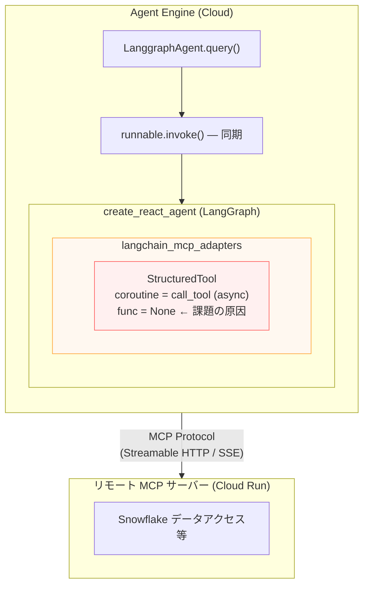
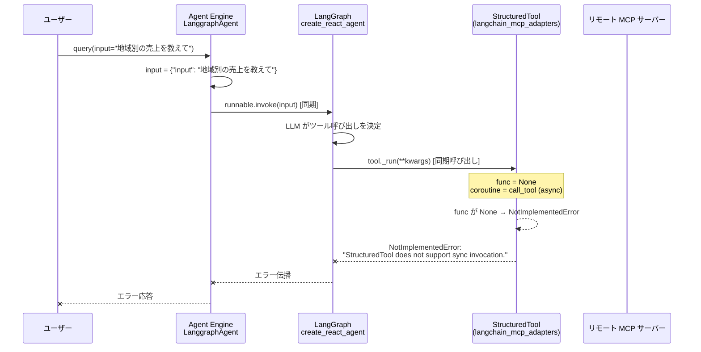
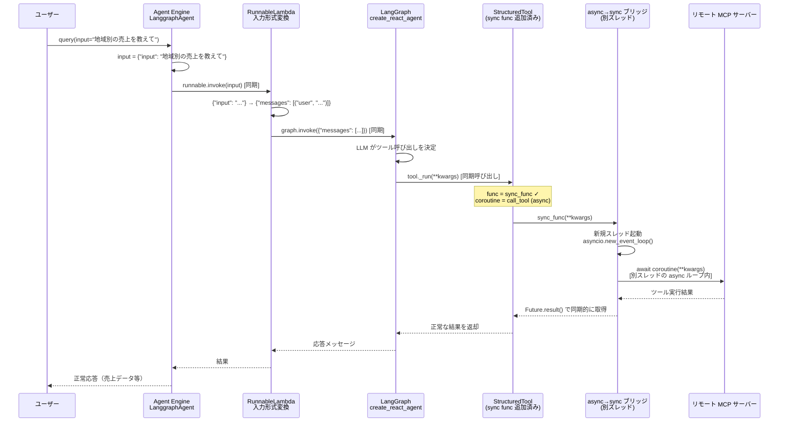
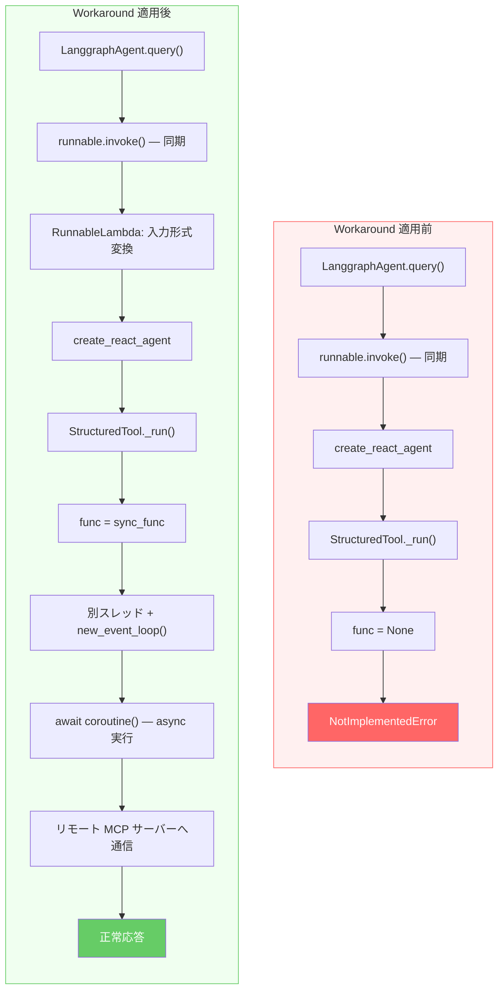

# Agent Engine + LangGraph + MCP 連携における async/sync 互換性課題と Workaround

## 1. エグゼクティブサマリー

Agent Engine 上で LangGraph エージェントからリモート MCP サーバーのツールを利用する際、`langchain_mcp_adapters` が生成するツールが **非同期（async）専用** である一方、Agent Engine の `LanggraphAgent.query()` が **同期（sync）呼び出し** のみをサポートしているため、ツール実行時に `NotImplementedError` が発生する課題を確認しました。

本ドキュメントでは、課題の根本原因をソースコードレベルで特定し、ADK が内部で採用している「別スレッド + 新規イベントループ」パターンを応用した Workaround の実装・検証結果を報告します。

---

## 2. 課題の概要

### 2.1 構成



### 2.2 課題の再現

Agent Engine にデプロイした LangGraph エージェントに対して `query()` を実行すると、MCP ツール呼び出し時に以下のエラーが発生します。

```
NotImplementedError: StructuredTool does not support sync invocation.
```

---

## 3. 根本原因の分析

### 3.1 原因の連鎖（3つのコンポーネント）

課題は以下の3つのコンポーネント間の **async/sync 不整合** に起因します。

#### (1) langchain\_mcp\_adapters — async-only ツール生成

`langchain_mcp_adapters/tools.py` （320-327行目）:

```python
return StructuredTool(
    name=tool.name,
    description=tool.description or "",
    args_schema=tool.inputSchema,
    coroutine=call_tool,          # ← async 関数のみ設定
    # func=... は設定されない     # ← 同期関数が未設定
    response_format="content_and_artifact",
    metadata=metadata,
)
```

MCP プロトコル自体が非同期通信（HTTP/SSE）を前提としているため、`langchain_mcp_adapters` は `coroutine`（非同期関数）のみを持つ `StructuredTool` を生成します。同期の `func` は設定されません。

#### (2) langchain\_core — func=None で NotImplementedError

`langchain_core/tools/structured.py` （92-99行目）:

```python
def _run(self, *args, config, run_manager=None, **kwargs):
    if self.func:                    # ← func が None なのでスキップ
        # ... 同期実行 ...
        return self.func(*args, **kwargs)
    msg = "StructuredTool does not support sync invocation."
    raise NotImplementedError(msg)   # ← ここでエラー
```

`StructuredTool._run()`（同期呼び出し）は `func` が設定されていない場合に `NotImplementedError` を発生させます。

#### (3) Agent Engine LanggraphAgent — 同期 invoke のみ

`vertexai/agent_engines/templates/langgraph.py` （557-567行目）:

```python
def query(self, *, input, config=None, **kwargs):
    from langchain.load import dump as langchain_load_dump
    if isinstance(input, str):
        input = {"input": input}
    if not self._tmpl_attrs.get("runnable"):
        self.set_up()
    return langchain_load_dump.dumpd(
        self._tmpl_attrs.get("runnable").invoke(    # ← 同期 invoke のみ
            input=input, config=config, **kwargs
        )
    )
```

`LanggraphAgent.query()` は `runnable.invoke()` を呼び出します。これは同期メソッドであり、`ainvoke()`（非同期）は使用されません。

### 3.2 エラー発生フロー（Workaround 適用前）



### 3.3 ADK との比較

ADK（Agent Development Kit）で MCP サーバーを利用する場合は、ADK Runner が内部で非同期実行を適切にハンドリングしています。具体的には、ADK Runner は **別スレッドで新しいイベントループを作成** して非同期処理を実行する仕組みを持っています。

一方、LangGraph + `langchain_mcp_adapters` の組み合わせでは、このような async→sync ブリッジが存在しないため、Agent Engine の同期実行環境との間にギャップが生じます。

---

## 4. Workaround の実装

### 4.1 設計方針

ADK Runner が採用する **「別スレッド + `asyncio.new_event_loop()`」パターン** を応用し、`langchain_mcp_adapters` が生成する async-only ツールに同期 `func` を追加するアダプターを実装しました。

### 4.2 アーキテクチャ（Workaround 適用後）



### 4.3 コア実装: `mcp_sync_adapter.py`

#### 4.3.1 async→sync ブリッジ関数

```python
import asyncio
import concurrent.futures
import threading

def _run_async_in_thread(coro_func, *args, timeout=120, **kwargs):
    """別スレッドで新しいイベントループを作成し、async 関数を同期的に実行する."""
    future = concurrent.futures.Future()

    def _thread_target():
        loop = asyncio.new_event_loop()
        try:
            result = loop.run_until_complete(coro_func(*args, **kwargs))
            future.set_result(result)
        except Exception as e:
            future.set_exception(e)
        finally:
            loop.close()

    thread = threading.Thread(target=_thread_target, daemon=True)
    thread.start()
    return future.result(timeout=timeout)
```

**設計ポイント**:

| 要素 | 説明 |
|------|------|
| `threading.Thread` | 別スレッドで実行することで、Agent Engine の既存イベントループとの衝突を回避 |
| `asyncio.new_event_loop()` | 各呼び出しで新しいイベントループを作成。既存ループへの依存を排除 |
| `concurrent.futures.Future` | スレッド間のデータ受け渡しとエラー伝搬を安全に実現 |
| `timeout` | ネットワーク遅延等による無限待ちを防止 |

#### 4.3.2 ツールラッパー関数

```python
from langchain_core.tools import BaseTool, StructuredTool

def make_sync_tool(async_tool, timeout=60):
    """async-only ツールに同期 func を追加した StructuredTool を返す."""
    original_coroutine = async_tool.coroutine
    if original_coroutine is None:
        return async_tool  # 既に sync 対応済み

    def sync_func(**kwargs):
        return _run_async_in_thread(original_coroutine, timeout=timeout, **kwargs)

    return StructuredTool(
        name=async_tool.name,
        description=async_tool.description,
        args_schema=async_tool.args_schema,
        func=sync_func,                  # ← 同期 func を追加
        coroutine=original_coroutine,     # ← async も保持
        response_format=getattr(async_tool, "response_format", "content"),
        metadata=async_tool.metadata,
    )

def make_sync_tools(async_tools, timeout=60):
    """ツールリスト全体を同期対応に変換する."""
    return [make_sync_tool(tool, timeout=timeout) for tool in async_tools]
```

**変換前後の比較**:

| 属性 | 変換前（langchain\_mcp\_adapters） | 変換後（Workaround 適用） |
|------|------|------|
| `func` | `None` | `sync_func` (別スレッドで async を実行) |
| `coroutine` | `call_tool` (async) | `call_tool` (async) ← そのまま保持 |
| 同期 invoke | `NotImplementedError` | 正常実行 |
| 非同期 ainvoke | 正常実行 | 正常実行 |

### 4.4 入力形式変換: `_transform_input` + `_wrap_graph_for_agent_engine`

`LanggraphAgent.query()` は文字列入力を `{"input": "..."}` に変換しますが、`create_react_agent` は `{"messages": [("user", "...")]}` を期待します。この不一致を `RunnableLambda` で吸収します。

```python
from langchain_core.runnables import RunnableLambda

def _transform_input(input_dict):
    """Agent Engine の入力形式を create_react_agent の形式に変換する."""
    if "messages" in input_dict:
        return input_dict
    user_input = input_dict.get("input", "")
    return {"messages": [("user", user_input)]}

def _wrap_graph_for_agent_engine(graph):
    """create_react_agent のグラフを Agent Engine の入力形式に対応させる."""
    return RunnableLambda(_transform_input) | graph
```

### 4.5 エージェント構築: `agent.py`

```python
from vertexai.agent_engines import LanggraphAgent

def create_agent_with_adapter(model="gemini-2.5-flash", mcp_servers=None):
    """Workaround 適用エージェントを作成."""

    def _builder(*, model, tools, checkpointer, model_tool_kwargs, runnable_kwargs):
        # 1. MCP サーバーからツールを同期的にロード
        mcp_tools = _load_mcp_tools(mcp_servers)
        # 2. async-only ツールに同期 func を追加
        sync_mcp_tools = make_sync_tools(mcp_tools)
        # 3. LangGraph グラフを構築
        graph = create_react_agent(model, tools=sync_mcp_tools, checkpointer=checkpointer)
        # 4. 入力形式変換を追加
        return _wrap_graph_for_agent_engine(graph)

    return LanggraphAgent(model=model, runnable_builder=_builder)
```

### 4.6 Workaround 適用による変化の全体像



---

## 5. 検証結果

### 5.1 ローカルテスト

| # | テスト | 期待結果 | 結果 |
|---|--------|----------|------|
| 1 | async テスト (`graph.ainvoke`) | MCP ツール正常実行 | **PASS** |
| 2 | sync テスト — アダプターなし (`graph.invoke`) | `NotImplementedError` 発生 | **PASS** |
| 3 | sync テスト — アダプターあり (`graph.invoke`) | MCP ツール正常実行 | **PASS** |
| 4 | Agent Engine 入力形式テスト (`{"input": "..."}`) | 入力変換 → 正常実行 | **PASS** |

### 5.2 Agent Engine デプロイテスト

Cloud Run 上の Snowflake MCP サーバー（実データ: ~100万件）に接続して検証。

#### アダプターなし（課題再現）

```
Resource: projects/781890406104/locations/us-central1/reasoningEngines/3205374362618167296

ToolMessage:
  content: "Error: NotImplementedError('StructuredTool does not support sync invocation.')
            Please fix your mistakes."
  name: "mcp_get_sales_summary"
  status: "error"
```

→ **`NotImplementedError` が発生し、MCP ツールを呼び出せない。**

#### アダプターあり（Workaround 適用）

```
Resource: projects/781890406104/locations/us-central1/reasoningEngines/3831937660776087552

ToolMessage:
  content: '{"columns": ["REGION", "UNITS_SOLD", "TOTAL_REVENUE_USD", "AVG_UNIT_PRICE"],
             "row_count": 5,
             "data": [
               {"REGION": "Asia Pacific", "UNITS_SOLD": 349687,
                "TOTAL_REVENUE_USD": "11250141248.59", "AVG_UNIT_PRICE": "31686.07"},
               {"REGION": "North America", "UNITS_SOLD": 300687, ...},
               {"REGION": "Europe", "UNITS_SOLD": 179866, ...},
               {"REGION": "Middle East", "UNITS_SOLD": 99976, ...},
               {"REGION": "South America", "UNITS_SOLD": 69884, ...}
             ]}'
  name: "mcp_get_sales_summary"
  status: "success"
```

→ **MCP ツールが正常に呼び出され、Snowflake から実データを取得できた。**

---

## 6. 使用バージョン

| パッケージ | バージョン |
|-----------|-----------|
| `google-cloud-aiplatform` | 1.132.0 |
| `langchain-mcp-adapters` | 0.1.14 |
| `langchain` | 0.3.25 |
| `langchain-core` | 0.3.61 |
| `langgraph` | 0.4.7 |
| `mcp` | 1.9.2 |
| Python | 3.13 |

---

## 7. 参照ソースコード

| ファイル | 行番号 | 説明 |
|---------|--------|------|
| `langchain_mcp_adapters/tools.py` | 320-327 | `StructuredTool(coroutine=call_tool)` — func 未設定 |
| `langchain_core/tools/structured.py` | 92-99 | `_run()` で `func=None` なら `NotImplementedError` |
| `vertexai/agent_engines/templates/langgraph.py` | 557-567 | `query()` → `runnable.invoke()` 同期のみ |

---

## 8. リポジトリ構成

```
langgraph_mcp_agent_engine/
├── __init__.py
├── mcp_sync_adapter.py    # コア: async→sync ブリッジ
├── agent.py               # LangGraph エージェント定義（with/without adapter）
├── deploy.py              # Agent Engine デプロイスクリプト
├── test_local.py          # ローカルテスト（4パターン）
├── test_mcp_server.py     # テスト用 FastMCP サーバー（stdio）
├── requirements.txt
└── pyproject.toml
```
