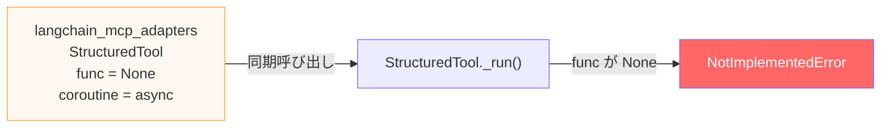
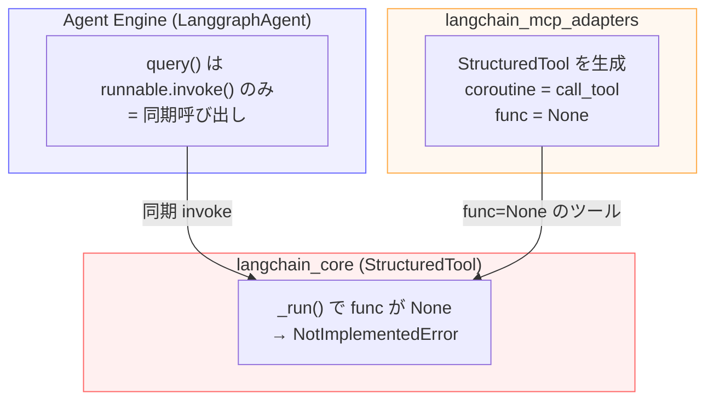
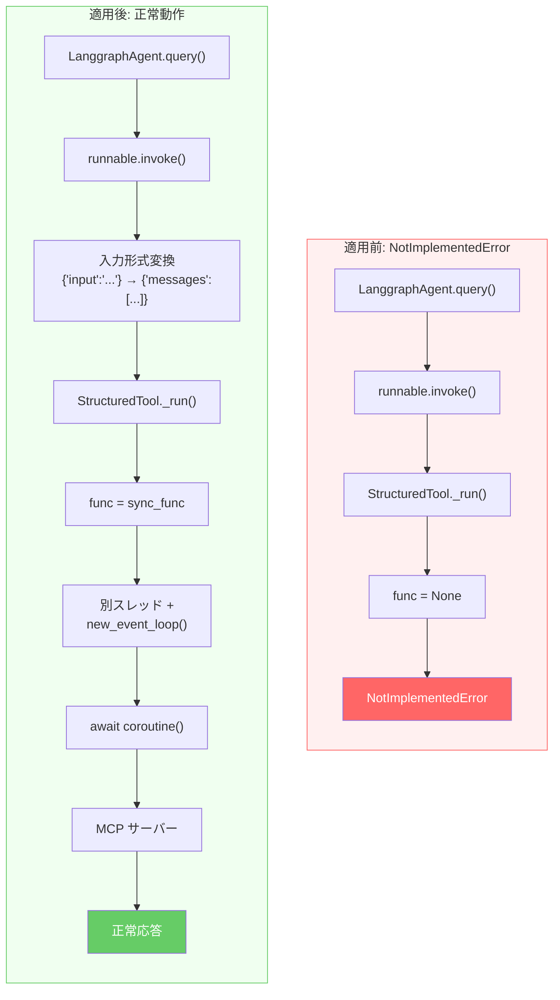
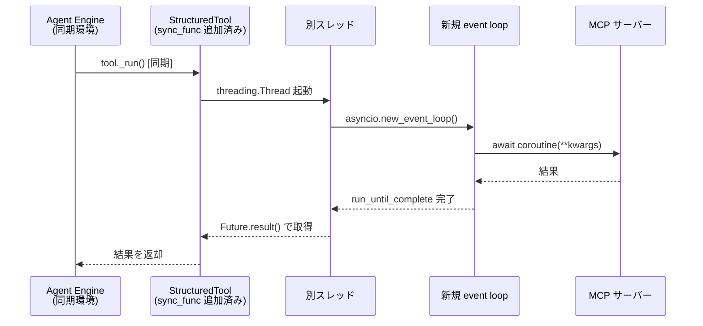
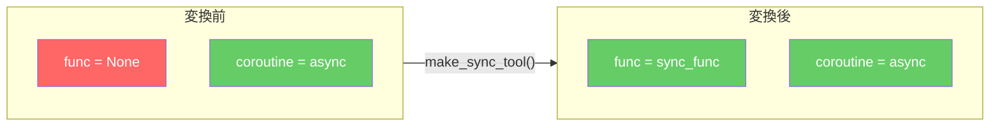

# LangGraph + MCP on Agent Engine — 課題と Workaround

## 課題: async/sync の不整合

Agent Engine の `LanggraphAgent.query()` は **同期 invoke** のみだが、`langchain_mcp_adapters` は **async-only** のツールを生成するため、MCP ツール呼び出し時に `NotImplementedError` が発生する。



## 根本原因: 3つのコンポーネントの不整合



## Workaround 適用前 → 適用後



## Workaround の仕組み: async→sync ブリッジ



## コア実装

### make_sync_tool: async ツールに同期 func を追加

```python
def make_sync_tool(async_tool, timeout=60):
    original_coroutine = async_tool.coroutine

    def sync_func(**kwargs):
        # 別スレッドで新規イベントループを作成し async を実行
        return _run_async_in_thread(original_coroutine, timeout=timeout, **kwargs)

    return StructuredTool(
        func=sync_func,               # ← 同期 func を追加
        coroutine=original_coroutine,  # ← async も保持
        ...
    )
```

### ツール属性の変化



## 検証結果

| テスト | 結果 |
|--------|------|
| ローカル: async (`ainvoke`) | **PASS** |
| ローカル: sync アダプターなし (`invoke`) | **PASS** — `NotImplementedError` 再現 |
| ローカル: sync アダプターあり (`invoke`) | **PASS** — 正常動作 |
| Agent Engine: アダプターなし | **`NotImplementedError`** 発生 |
| Agent Engine: アダプターあり | **正常応答** — Snowflake 実データ取得成功 |
